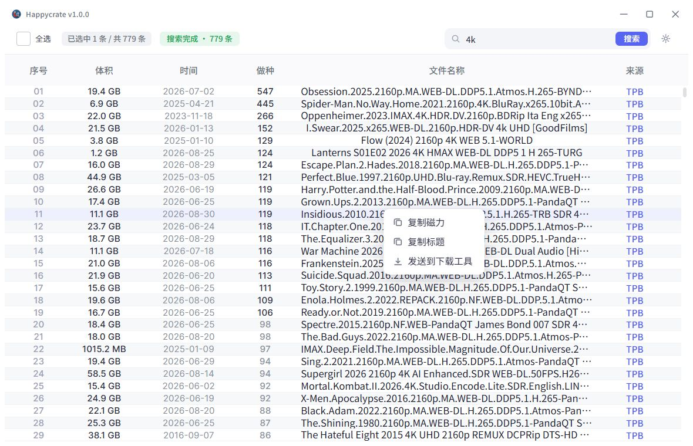

# Happycrate · 快乐聚盒

磁力搜索聚合与下载投递工具。Windows 桌面程序，纯本地运行，不需要注册或登录。



## 它做什么

一次输入关键词，同时检索 9 个公开磁力索引站，把结果按 info_hash 去重合并成一张表，
选中后批量复制磁力链接，或者直接投递到迅雷。

- **内置源**：海盗湾、Nyaa、蜜柑计划、动漫花园、Sukebei、EZTV、BitSearch、TPB 镜像、小草磁力
- **去重合并**：同一个种子被多个站点收录时合并成一行，保留字段更全的那份
- **自定义源**：支持 RSS / JSON / HTML 三种类型，自己填 URL 和抽取规则即可接入
- **健康度**：每个源记录最近若干次搜索的结果，故障与「长期零结果」分开显示，持续故障会自动降权
- **批量操作**：框选、全选、按列排序，右键批量复制磁力或标题
- **投递迅雷**：协议拉起与 COM 接口两种方式，自动挑选可用的那个
- **网络出口**：可填手动代理，也可跟随系统代理；设置页会真实探测代理是否转发请求
- **外观**：浅色 / 深色主题，字号三档

## 运行

下载发行包解压后双击 `happycrate.exe` 即可，无需安装 Python。

首次启动若提示缺少 WebView2，按弹窗里的地址装一下运行库（地址会自动复制到剪贴板）。

## 从源码运行

需要 Python 3.11 ~ 3.13 和 Windows。

```bash
python -m venv .venv
.venv/Scripts/pip install -e .
.venv/Scripts/python main.py
```

## 打包

```bash
.venv/Scripts/pip install pyinstaller
.venv/Scripts/python -m PyInstaller happycrate.spec --noconfirm
```

产物在 `dist/happycrate/`。`app/` 与 `web/` 是外置的，不编译进 exe，
所以改了源码只需要把同名文件复制到 `dist/happycrate/_internal/` 下对应位置，重启即生效；
只有新增或删除第三方依赖时才需要重新打包。

## 目录

| 路径 | 内容 |
| --- | --- |
| `app/` | 后端：源适配器、搜索调度、配置与健康度、下载投递、窗口外壳 |
| `web/` | 前端：原生 JS + CSS，无构建步骤 |
| `data/` | 运行时数据。`sources.json` 是内置源清单（纳入版本管理），其余为本地状态 |
| `tests/` | 单元测试与前端冒烟脚本 |

## 测试

```bash
.venv/Scripts/python -m unittest discover -s tests -p "test_*.py"
node tests/front_smoke.cjs
```

## 说明

- 本工具不提供、不存储、不校验任何资源内容，只聚合各公开索引站返回的公开条目。
- 搜索请求直接发往各索引站，本工具不做中转，也不保留查询记录。
- 不涉及账号体系：不登录，不保存任何站点的用户名或令牌。迅雷只是被唤起的下载工具，
  登录与配额由它自己处理。
- 请遵守所在地法律法规，勿用于下载或传播受版权保护的内容。

## 许可

MIT，见 [LICENSE](LICENSE)。
