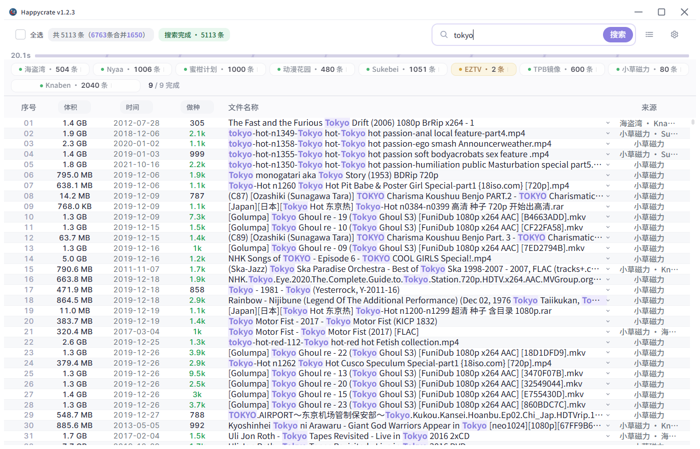

<h1 align="center">Happycrate · 快乐箱</h1>

<p align="center"></p>

<p align="center"><strong>磁力搜索聚合工具</strong></p>

<p align="center"><a href="https://github.com/GVHBOX/Happycrate/releases/latest">下载最新发行包</a> · <a href="LICENSE">许可证</a></p>

<p align="center"></p>

## 功能

- **内置源**：海盗湾、Nyaa、蜜柑计划、动漫花园、Sukebei、EZTV、BitSearch、TPB镜像、小草磁力、Knaben
- **去重合并**：关键词同时检索10个公开磁力索引站，结果去重合并成一张列表，选中后批量复制磁力链接
- **批量操作**：框选、全选、按列排序，右键批量复制磁力或标题

## 运行

1. 从[发行页](https://github.com/GVHBOX/Happycrate/releases/latest)下载最新一版的 zip 并解压。
2. 双击 `happycrate.exe`，无需安装 Python。
3. 首次启动若提示缺少 WebView2，按弹窗里的地址装一下运行库，地址会自动复制到剪贴板。

## 从源码开发

需要 Python 3.11 ~ 3.13 和 Windows。

```bash
python -m venv .venv
.venv/Scripts/pip install -e .
.venv/Scripts/python main.py
```

测试：

```bash
.venv/Scripts/python -m unittest discover -s tests -p "test_*.py"
node tests/front_smoke.cjs
```

打包：

```bash
.venv/Scripts/pip install pyinstaller
.venv/Scripts/python -m PyInstaller happycrate.spec --noconfirm
```

产物在 `dist/happycrate/`。`app/` 与 `web/` 是外置的，不编译进 exe，所以改了源码只需把同名文件
复制到 `dist/happycrate/_internal/` 下对应位置，重启即生效；只有新增或删除第三方依赖时才需重新打包。

## 目录

| 路径        | 内容                                          |
| --------- | ------------------------------------------- |
| `app/`    | 后端：源适配器、搜索调度、配置与健康度、下载投递、窗口外壳               |
| `web/`    | 前端：原生 JS + CSS，无构建步骤                        |
| `assets/` | 图标与 README 截图                               |
| `data/`   | 运行时数据。`sources.json` 是内置源清单（纳入版本管理），其余为本地状态 |
| `tests/`  | 单元测试与前端冒烟脚本                                 |
| `tools/`  | 生产辅助工具：代码体检扫描器、dist 同步、护栏回归；清单见 `tools/README.md` |
| `dist/`   | 构建产物，`happycrate.exe` 在 `dist/happycrate/` 下    |

## 说明

- **内容来源**：不提供、不存储、不校验任何资源内容，只聚合各公开索引站返回的公开条目。
- **请求去向**：搜索请求直接发往各索引站，不做中转，不保留查询记录；不涉及账号体系，不登录、不保存任何站点的凭据。
- **合规**：请遵守所在地法律法规，勿用于下载或传播受版权保护的内容。

## 许可证

MIT，见 [LICENSE](LICENSE)。
