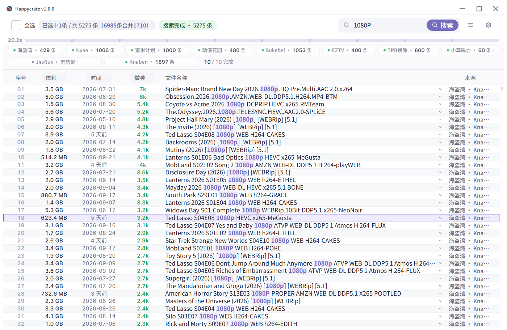

<h1 align="center">Happycrate · 快乐箱</h1>

<p align="center"></p>

<p align="center"><strong>磁力搜索聚合工具</strong></p>

<p align="center"><a href="https://github.com/GVHBOX/Happycrate/releases/latest">下载</a></p>

<p align="center"></p>

https://github.com/user-attachments/assets/62700545-29a4-45e2-9c8e-82441daeff5b

## 特点

- **内置源**：海盗湾、Nyaa、蜜柑计划、动漫花园、Sukebei、EZTV、BitSearch（源站出问题，默认关闭）、TPB镜像、小草磁力、Knaben、JavBus、JavDB（需要账号，默认关闭），
- **去重+合并**：默认只开10个搜索站，并发收集按 info_hash 并成一张列表
- **批量操作**：框选、全选、按列排序，大小筛选，右键批量复制磁力或标题
- **以搜集为主**：0做种、老种、死链一律保留，暂时为了量大而牺牲性能和速度，可用迅雷，115和Pikpak去解决老资源，冷门资源的问题
- **内容来源**：不提供、不存储、不校验任何资源内容，只聚合公开索引站的公开条目。
- **请求去向**：请求直连各索引站，不中转、不留查询记录；无账号体系，不保存站点凭据。

## 运行

从[发行页](https://github.com/GVHBOX/Happycrate/releases/latest)下载 `happycrate.exe`，双击即可，无需安装 Python 或任何运行时。

界面由系统自带的 WebView2 渲染。Windows 10 1809 以上与 Windows 11 自带 Edge，开箱即用；精简版系统若提示缺少 WebView2，装一下 [Microsoft Edge WebView2 Runtime](https://developer.microsoft.com/microsoft-edge/webview2/) 即可。

数据目录优先在 exe 旁边生成（`data/`：`settings.json`、`sources.json`、`logs/`），
exe 所在目录不可写时退到 `%APPDATA%\Happycrate\data`；删掉会恢复默认。

## 开发

需要 Rust 工具链与 Windows，本机已装 WebView2。

```bash
cargo build --release   # 产物在 target/release/happycrate.exe
cargo test              # 全量测试
```

前端 `web/` 是**编译期内嵌**进 exe 的（由 `tauri.conf.json` 的 `frontendDist` 指定），
所以改完 JS / CSS 要重新 `cargo build --release` 才会进 exe，不存在"改文件即生效"。
日常开发用 `cargo run` 走 debug 编译，比 release 快得多。

测试分两类：常规单测，以及**金样对照**——`tests/fixtures/` 存着 12 个源的真实响应体，
`tests/parity/` 存着 Python 版跑出的期望输出，Rust 侧跑完逐字段比对。改适配器后
`cargo test` 会立刻告诉你有没有改动真实解析结果。

零注释由 `python tools/scan_comment.py` 强制（输出全空即通过）。图标由
`python tools/make_icon.py` 从 `web/assets/app-256.png` 派生。

## 目录

| 路径 | 内容 |
| --- | --- |
| `src/` | 后端：适配器、网络层、调度、配置、投递 |
| `src/sources/` | 12 个索引站适配器，一源一文件 |
| `web/` | 前端：原生 JS + CSS，无构建步骤 |
| `assets/` | 应用图标、README 截图与演示视频 |
| `tests/` | 单元测试、金样与 parity 对照 |
| `tools/` | 开发工具：图标生成、零注释扫描、金样采集与对照表生成 |
| `target/` | 构建产物，exe 在 `target/release/` |

## 关于这个仓库的历史

本仓是原 Python + pywebview 版的 **Rust + Tauri 2 重写**。前端 `web/` 整份沿用，
后端换成 Rust，`settings.json` 与 `sources.json` 的格式经金样对照测试逐字段核对，与旧版一致。

迁移过程中的取舍、金样体系的做法、以及尚未补齐的部分（健康记录持久化等）都记在
`PLAN.md`；作业规程在 `AGENTS.md`。
