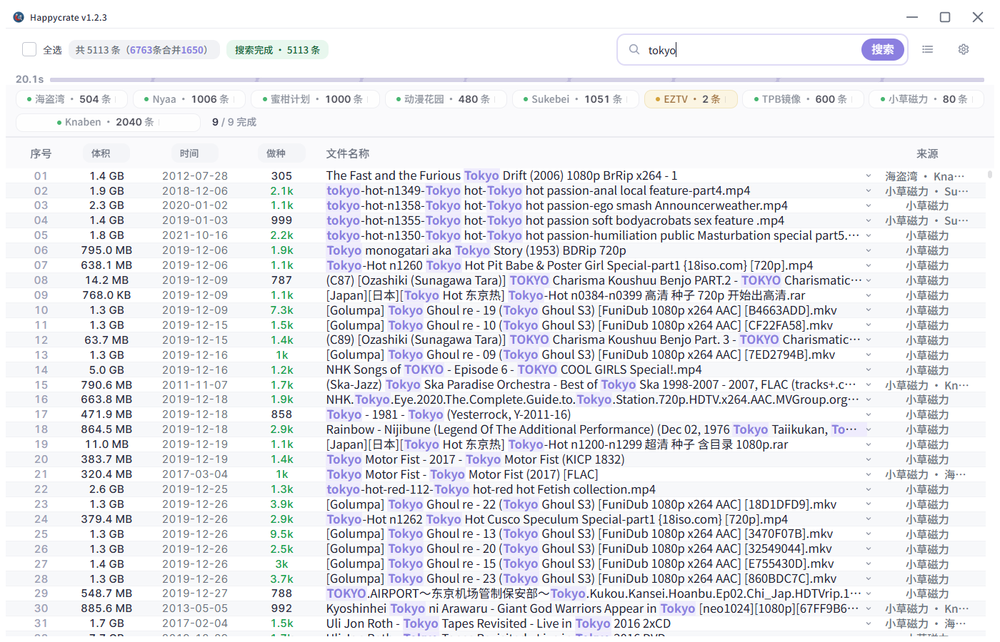

<h1 align="center">Happycrate · 快乐箱</h1>

<p align="center"></p>

<p align="center"><strong>磁力搜索聚合工具</strong></p>

<p align="center"><a href="https://github.com/GVHBOX/Happycrate/releases/latest">下载</a></p>

<p align="center"></p>

<p align="center"><video src="assets/core_features_preview.mp4" controls muted loop playsinline autoplay width="880"></video></p>

## 功能

- **内置源**：海盗湾、Nyaa、蜜柑计划、动漫花园、Sukebei、EZTV、BitSearch、TPB镜像、小草磁力、Knaben、JavBus、JavDB
- **去重合并**：同时检索 12 个公开磁力索引站（默认开 10，另两个在数据源页可打开），按 info_hash 并成一张表
- **健康度**：故障与「长期零结果」分开显示，持续故障自动沉底
- **配置自愈**：配置文件读不出来时自动备份成 `.broken.json` 再回退默认，并把备份位置说给你，不会静默丢掉设置
- **批量操作**：框选、全选、按列排序，右键批量复制磁力或标题
- **投递迅雷**：协议拉起与 COM 接口两种方式，自动挑可用的那个

## 运行

从[发行页](https://github.com/GVHBOX/Happycrate/releases/latest)下载 zip 解压，双击 `happycrate.exe`，无需安装 Python。
首次启动若提示缺少 WebView2，按弹窗里的地址装一下运行库。

## 从源码开发

需要 Python 3.11 ~ 3.13 和 Windows。

```bash
python -m venv .venv
.venv/Scripts/pip install -e .
.venv/Scripts/python main.py
```

测试：

```bash
.venv/Scripts/python tools/check-all.py     # 一键全检（--all 再加 E2E 与护栏回归）
.venv/Scripts/python -m unittest discover -t . -s tests -p "test_*.py"
node tests/front_smoke.cjs
```

打包：

```bash
.venv/Scripts/pip install pyinstaller
.venv/Scripts/python -m PyInstaller happycrate.spec --noconfirm
```

产物在 `dist/happycrate/`。`app/`、`web/` 外置不编译进 exe，改源码把同名文件复制到
`dist/happycrate/_internal/` 对应位置重启即生效，增删第三方依赖才需重新打包。

## 目录

| 路径 | 内容 |
| --- | --- |
| `app/` | 后端：适配器、调度、配置、投递 |
| `web/` | 前端：原生 JS + CSS，无构建 |
| `assets/` | 图标与截图 |
| `data/` | 运行时数据，`sources.json` 纳入版本管理 |
| `tests/` | 单元测试、前端冒烟与 E2E |
| `tools/` | 开发工具，清单见 `tools/README.md` |
| `dist/` | 构建产物，exe 在 `dist/happycrate/` |

## 说明

- **只搜集不判断**：0 做种、老种、死链一律保留，能不能下取决于下载工具有没有存货，工具说了不算。
- **内容来源**：不提供、不存储、不校验任何资源内容，只聚合公开索引站的公开条目。
- **请求去向**：请求直连各索引站，不中转、不留查询记录；无账号体系，不保存站点凭据。
