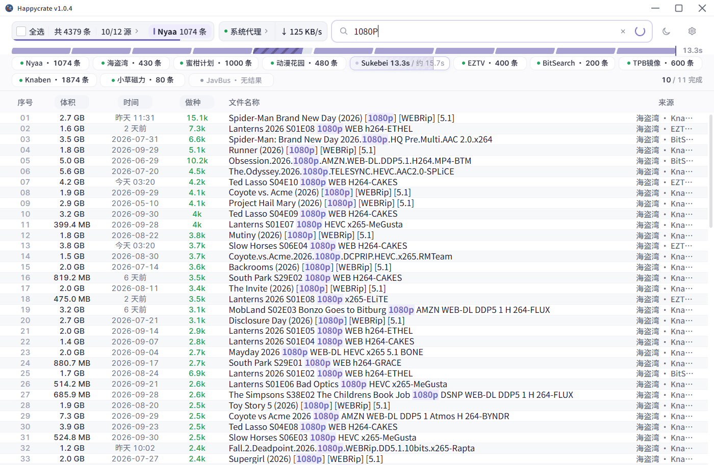
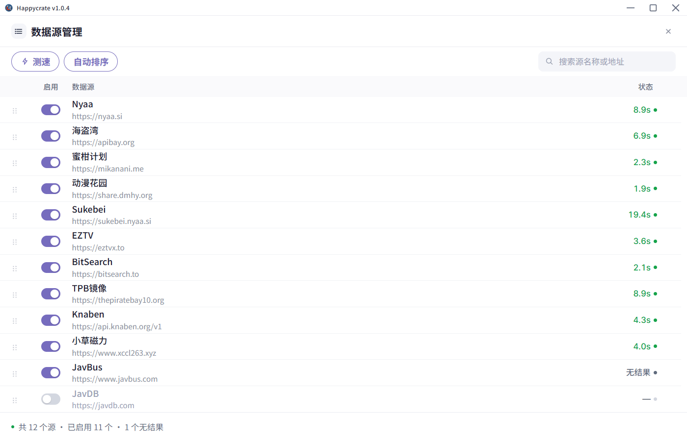

<div align="center">


# Happycrate · 快乐箱

**磁力搜索聚合工具**

[](https://github.com/GVHBOX/Happycrate/releases/latest)
[](LICENSE)
[](https://github.com/GVHBOX/Happycrate/releases/latest)
[](https://www.rust-lang.org/)
[](https://tauri.app/)

<br/>



</div>

---

## 特点

- **内置源**：海盗湾、Nyaa、蜜柑计划、动漫花园、Sukebei、EZTV、BitSearch（源站故障，默认关闭）、TPB 镜像、小草磁力、Knaben、JavBus、JavDB（需账号，默认关闭）
- **去重合并**：并发检索多站，按 `info_hash` 聚合去重为单一列表
- **批量操作**：多选、全选、列排序、文件大小筛选，右键批量复制磁力或标题
- **量大保全**：0 做种与老种全量保留，分块懒加载；支持一键唤起迅雷 / 115 / PikPak
- **隐私直连**：无中转服务器，请求直连索引站，不保存查询记录与账号凭据

---

## 界面与演示

<div align="center">



<p><a href="assets/preview.mp4">▶ 查看功能演示视频（preview.mp4）</a></p>

</div>

---

## 常见问题（FAQ）

**Q：搜索请求与数据会经过第三方服务器吗？**  
不会。所有请求均由本地直连各站点，本工具不设中转后端，不收集检索内容与硬件信息。

**Q：应用配置保存在哪里？**  
默认保存在程序同级目录的 `data/` 下（`settings.json`、`sources.json`）。目录只读时退回 `%APPDATA%\Happycrate\data`；删除即可重置。

**Q：如何配合下载工具使用？**  
右键结果条目可一键唤起迅雷、115 浏览器或 PikPak；也可直接批量复制磁力链接粘贴至任意下载器或离线网盘。

---

## 运行与构建

### 运行
从 [Releases](https://github.com/GVHBOX/Happycrate/releases/latest) 下载 `happycrate.exe` 直接运行（便携模式，无需安装额外运行时）。Windows 10 / 11 开箱即用。

### 编译
需要 Rust 1.85+ 与 MSVC 环境：
```powershell
cargo build --release
```
编译产物位于 `target\release\happycrate.exe`（前端 `web/` 已编译期内嵌）。

---

## 开源协议

本项目采用 [MIT License](LICENSE) 开源。
